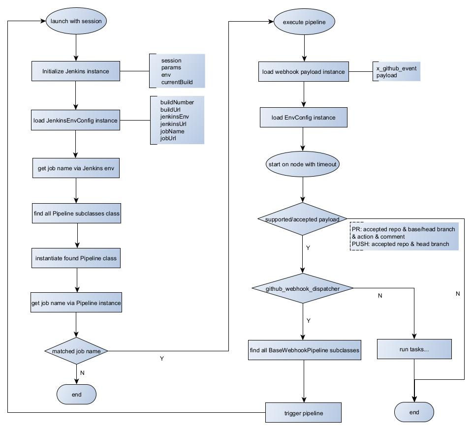

# Overview
1. 核心库引入：通过`@Library('\<lib\>@\<branch\>') _`指令引入核心库，并定义框架启动入口；
2. 上下文解析：从入口获取`session`上下文，解析env环境变量及`GithubEvent/payload`数据；
3. 动态实例化：根据环境变量`JOB_NAME`匹配对应的`Pipeline`类并完成实例化；
4. 事件对象封装：基于`GithubEvent`加载并实例化`Payload Bean`对象，适配不同`Github Webhook`事件类型；
5. 注解与类型拦截：根据支持的`Payload Bean`信息，匹配`Pipeline`类上的注解并拦截；
6. 执行调度：携带env与payload数据，在节点上触发Pipeline，其分支执行逻辑：\
  a. 若为`WebhookDispatcherPipeline`类型：则扫描所有继承`BaseWebhookPipeline`子类，触发对应`Jenkins Build`，之后重新进
入初始化流程；\
  b. 若非上述类型：直接执行当前Pipeline类对应的`Jenkins Build`。

# Workflow


# Prerequisites

## Configure Webhooks on GitHub Repo
**Settings** → **Hooks** → **Webhooks**  
- Payload URL  
  - `https://<username>:<token>@<jenkins-server>/generic-webhook-trigger/invoke`  
- Content type  
  - `application/json`  
- SSL verification  
  - `Enable SSL verification`  
- Which events would you like to trigger this webhook?  
  - Issue comments  
  - Labels  
  - Pull requests  
  - Pushes

## Configure Credentials on Jenkins Server
**Credentials** → **System** → **Global credentials (unrestricted)** → **Add Credentials**  
- Credentials  
  - Scope (e.g., `Global (Jenkins, nodes, items, all child items, etc)`)  
  - Username  
  - Treat username as secret  
  - Password  
  - ID (e.g., `GIT_BUILDER`)  
  - Description (e.g., `GitHub token for service account xxx`)

## Configure Environment on Jenkins Server
**Manage Jenkins** → **System**  
- Global properties  
  - Environment variables  
    - Name (e.g., `CFG_JENKINS_ENV`)  
    - Value (e.g., `test` or `product`)

## Configure Library on Jenkins Server
**Manage Jenkins** → **System**  
- Library  
  - Name (e.g., `xxx-qe-jenkins`)  
  - Default version (e.g., `main`)  
- Allow default version to be overridden  
- Include @Library changes in job recent changes  
- Retrieval method (`Modern SCM`)  
  - Source Code Management (`Git`)  
    - Project Repository (e.g., `https://<GitHub-server>/<owner>/<repo>.git`)  
    - Credentials (e.g., `GitHub token for service account xxx`)  
  - Library Path (optional) (e.g., `./`)

## Configure SMTP server on Jenkins Server
**Manage Jenkins** → **System**  
- E-mail Notification  
  - SMTP server (e.g., `smtp.xxx.com`)  
  - Default user e-mail suffix (e.g., `@xxx.com`)

## Install Plugins on Jenkins Server
**Manage Jenkins** → **Plugins**  
  - Generic Webhook Trigger  
  - Lockable Resources

## Configure Jenkins Job `github_webhook_dispatcher` on Jenkins Server
- Discard old builds  
  - Strategy (e.g., `Log Rotation`)  
    - Days to keep builds (e.g., `30` days)  
    - Max # of builds to keep (e.g., `500` records)  
- This project is parameterized  
  - String Parameter  
    - Name (e.g., `payload`)  
    - Default Value  
    - Trim the string  
- Triggers  
  - Generic Webhook Trigger  
    - Post content parameters  
      - Variable (e.g., `payload`)  
      - Expression (e.g., `$`)  
      - JSONPath  
    - Header parameters  
      - Request header (e.g., `X-GitHub-Event`)  
    - Cause  
      - GitHub web hook listener  
- Source Code Management  
  - Git  
    - Repositories  
      - Repository URL (e.g., `https://<GitHub-server>/<owner>/<repo>.git`)  
      - Credentials (e.g., `GitHub token for service account xxx`)  
    - Branches to build  
      - Branch Specifier (blank for 'any')  (e.g., `main`)  
- Pipeline  
  - Definition (Pipeline script)
    ```groovy title="pipeline script"
    // println(this.currentBuild.getDescription())
    // println(this.env.JOB_NAME)
    // println(this.env.WORKSPACE)
    
    /**在Jenkins Pipeline中引入共享库的指令，下划线_指示Groovy在解析代码时将库导入到当前命名空间中，允许调用该库中定义的步骤和函数*/
    @Library('devops-qe-jenkins@main') _
    /**Jenkins Pipeline的执行入口，this是该Jenkins session实例*/
    com.qe.jenkins.Launcher.launch(this)
    ```

# Workflow
_GitHub events (PULL_REQUEST, ISSUE_COMMENT, PUSH) to trigger Jenkins job `github_webhook_dispatcher` via `Generic Webhook Trigger` plugin._  
_Jenkins job can directly trigger pipeline which inherits base pipeline `BasePipeline` with payload as well._

## 1. Launch entry point `launch(this)` with Jenkins job (e.g., `github_webhook_dispatcher`, `check_code`) session
**Jenkins pipeline can get `env` (e.g., `JENKINS_URL`, `JOB_URL`, `BUILD_URL`), `params` and `currentBuild` via session**  
- Initialize `env`, `params` and `currentBuild` with session  
- Get job name via `env.getProperty("JOB_NAME")`

## 2. Find all pipeline class which inherits supper class `Pipeline` and filter the pipeline class which is corresponding to `JOB_NAME`
**Pipeline class inheritance hierarchy**
```plaintext title="pipeline class inheritance hierarchy"
Pipeline
└── BasePipeline
    ├── GithubWebhookDispatcherPipeline
    └── BaseWebhookPipeline
        ├── BaseWebhookPullRequestPipeline
        ├── BaseWebhookIssueCommentPipeline
        └── BaseWebhookPushPipeline
```
_Pipeline class to JOB_NAME mapping: `SimonDemoPipeline` → `simon_demo`_

## 3. Route to the matched pipeline entry point `execute()`
**`execute()` invocation sequence:**  
`init` → `load payload` → `load env config` → `pre-start` → `start` → `success/aborted/failed?` → `finish`
```groovy title="execute()"
    @Override
    void execute() {
        onInit()

        payload = Jenkins.loadPayload(getPayloadType())
        envConfig = Jenkins.loadEnvConfig(getEnvConfigType())
        printInfo()

        beforeStart()

        /** start pipeline workflow */
        Jenkins.node(getNodeLabel()) {
            Jenkins.allocateWorkspace(getWorkspace()) {
                try {
                    Jenkins.timeout(getTimeout()) {
                        start()
                    }
                    Jenkins.currentBuild.setResult(Result.SUCCESS)
                    onSuccess()
                } catch (FlowInterruptedException ignored) {
                    Jenkins.currentBuild.setResult(Result.ABORTED.toString())
                    onAborted()
                } catch (Throwable throwable) {
                    Jenkins.currentBuild.setResult(Result.FAILURE)
                    error(ExceptionUtil.stacktraceToString(throwable))
                    onFailed(throwable)
                } finally {
                    onFinish()
                }
            }
        }
    }
```
_`loadPayload(getPayloadType())` will call `getPayloadType()` in the matched pipeline class_  
_`loadEnvConfig(getEnvConfigType())` will call `getEnvConfigType()` in the matched pipeline class_

### If the matched pipeline is `GithubWebhookDispatcherPipeline`
- Load payload in `onInit()`  
  _Load payload according to EVENT_TYPE (`x_github_event`) and PAYLOAD (`payload`)_  
  - JSON payload to bean (`JSONUtil.toBean(payload, PullRequestPayload.class)`, `JSONUtil.toBean(payload, IssueCommentPayload.class)`, `JSONUtil.toBean(payload, PushPayload.class)`)  
- Start pipeline workflow in `start()`  
  - Find all pipeline class which inherits supper class `BaseWebhookPipeline`  
  - Check if it's supported payload (invoke `support()` in the the matched pipeline)  
  - Check if it's accepted payload VS pipeline annotation (invoke `accept(payload)` in the the matched pipeline)  
  - Trigger the matched pipeline with payload

### If the matched pipeline is a subclass of `BaseWebhookPullRequestPipeline`
_Triggered by pipeline `GithubWebhookDispatcherPipeline`, and re-launch entry point `launch(this)` with Jenkins job (e.g., `check_code`) session_  
- Load payload in `onInit()`  
  - JSON payload to bean (`JSONUtil.toBean(payload, PullRequestPayload.class)`, `JSONUtil.toBean(payload, IssueCommentPayload.class)`)  
  - Handle `GenericPullRequestPayload` payload (i.e. include property `PullRequestResponse`, `eventType`, `sender`, `repository`, `organization`)  
  - Wrap `GenericPullRequestPayloadWrapperImpl` class (e.g., wrap method `getBaseBranch()`, `getHeadBranch()`, `checkout()`, `updateStatus(...)`, `listFiles()`)  
- Get `PullRequestPayload` class in `getPayloadType()`  
- Get `XxxEnvConfig` class in `getEnvConfigType()`  
- Is supported payload (i.e. `PullRequestPayload`, `IssueCommentPayload`) in `Set<Class<? extends WebhookPayload>> support()`?  
- Is accepted payload VS pipeline annotation in `accept(WebhookPayload payload)`? e.g.,  
  `@GenericPullRequestListener(repository = ["<owner>/<repo>"], baseBranch = ["main"], action = [opened, reopened, synchronize], comment = "check xxx")`  
- Start pipeline workflow in `start()`

### If the matched pipeline is a subclass of `BaseWebhookIssueCommentPipeline`
_Triggered by pipeline `GithubWebhookDispatcherPipeline`, and re-launch entry point `launch(this)` with Jenkins job (e.g., `check_code`) session_  
_It's similar to `BaseWebhookPullRequestPipeline`_

### If the matched pipeline is a subclass of `BaseWebhookPushPipeline`
_Triggered by pipeline `GithubWebhookDispatcherPipeline`, and re-launch entry point `launch(this)` with Jenkins job (e.g., `deploy_code`) session_  
- Get `PushPayload` class in `getPayloadType()`  
- Get `XxxEnvConfig` class in `getEnvConfigType()`  
- Is supported payload (i.e. `PushPayload`) in `Set<Class<? extends WebhookPayload>> support()`?  
- Is accepted payload VS pipeline annotation in `accept(WebhookPayload payload)`? e.g.,  
  `@PushListener(repository = ["<owner>/<repo>"], branch = ["main"])`  
- Start pipeline workflow in `start()`

### If the matched pipeline is a direct subclass of `BasePipeline`
_The matched pipeline class can override `execute()` or `start()` from super class `BasePipeline`_  
- Start pipeline workflow in `start()` directly from entry point `execute()`
