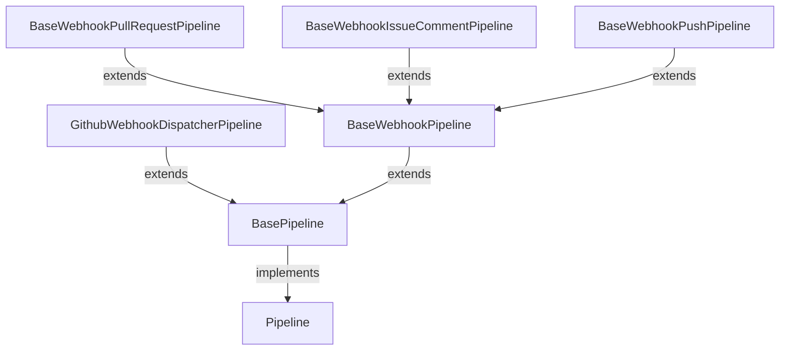

# Prerequisites

## Configure Webhooks on GitHub Repo
**Settings** → **Hooks** → **Webhooks**
- Payload URL  
  - `https://<username>:<token>@<jenkins-server>/generic-webhook-trigger/invoke`
- Content type  
  - `application/json`
- SSL verification  
  - `Enable SSL verification`
- Which events would you like to trigger this webhook?  
  - Issue comments
  - Labels
  - Pull requests
  - Pushes

## Configure Credentials on Jenkins Server
**Credentials** → **System** → **Global credentials (unrestricted)** → **Add Credentials**
- Credentials
  - Scope (e.g., `Global (Jenkins, nodes, items, all child items, etc)`)
  - Username
  - Treat username as secret
  - Password
  - ID (e.g., `GIT_BUILDER`)
  - Description (e.g., `GitHub token for service account xxx`)

## Configure Environment on Jenkins Server
**Manage Jenkins** → **System**
- Global properties
  - Environment variables
    - Name (e.g., `CFG_JENKINS_ENV`)
    - Value (e.g., `test` or `product`)

## Configure Library on Jenkins Server
**Manage Jenkins** → **System**
- Library
  - Name (e.g., `xxx-qe-jenkins`)
  - Default version (e.g., `main`)
- Allow default version to be overridden
- Include @Library changes in job recent changes
- Retrieval method (`Modern SCM`)
  - Source Code Management (`Git`)
    - Project Repository (e.g., `https://<GitHub-server>/<owner>/<repo>.git`)
    - Credentials (e.g., `GitHub token for service account xxx`)
  - Library Path (optional) (e.g., `./`)

## Configure SMTP server on Jenkins Server
**Manage Jenkins** → **System**
- E-mail Notification
  - SMTP server (e.g., `smtp.xxx.com`)
  - Default user e-mail suffix (e.g., `@xxx.com`)

## Install Plugins on Jenkins Server
**Manage Jenkins** → **Plugins**
  - Generic Webhook Trigger
  - Lockable Resources

## Configure Jenkins Job `github_webhook_dispatcher` on Jenkins Server
- Discard old builds
  - Strategy (e.g., `Log Rotation`)
    - Days to keep builds (e.g., `30` days)
    - Max # of builds to keep (e.g., `500` records)
- This project is parameterized
  - String Parameter
    - Name (e.g., `payload`)
    - Default Value
    - Trim the string
- Triggers
  - Generic Webhook Trigger
    - Post content parameters
      - Variable (e.g., `payload`)
      - Expression (e.g., `$`)
      - JSONPath
    - Header parameters
      - Request header (e.g., `X-GitHub-Event`)
    - Cause
      - GitHub web hook listener
- Source Code Management
  - Git
    - Repositories
      - Repository URL (e.g., `https://<GitHub-server>/<owner>/<repo>.git`)
      - Credentials (e.g., `GitHub token for service account xxx`)
    - Branches to build
      - Branch Specifier (blank for 'any')  (e.g., `main`)
- Pipeline
  - Definition (Pipeline script)
    ```groovy title="pipeline script"
    // println(this.currentBuild.getDescription())
    // println(this.env.JOB_NAME)
    // println(this.env.WORKSPACE)
    
    /**在Jenkins Pipeline中引入共享库的指令，下划线_指示Groovy在解析代码时将库导入到当前命名空间中，允许调用该库中定义的步骤和函数*/
    @Library('xxx-qe-jenkins@main') _
    /**Jenkins Pipeline的执行入口，this是该Jenkins session实例*/
    com.corp.product.jenkins.Launcher.launch(this)
    ```

# Workflow
_GitHub events (ISSUE_COMMENT, PULL_REQUEST, PUSH) to trigger Jenkins job github_webhook_dispatcher via Generic Webhook Trigger plugin._

## 1. Launch entry `launch(this)` with this Jenkins job `github_webhook_dispatcher` session
**Jenkins pipeline can get env params (e.g., `JENKINS_URL`, `JOB_URL`, `BUILD_URL`) and currentBuild info via session**

## 2. Find all pipeline class which inherits supper class `Pipeline` and filter the pipeline class which is corresponding to `JOB_NAME`
**Pipeline class inheritance hierarchy**
```plaintext title="pipeline class inheritance hierarchy"
Pipeline
└── BasePipeline
    ├── GithubWebhookDispatcherPipeline
    └── BaseWebhookPipeline
        ├── BaseWebhookPullRequestPipeline
        ├── BaseWebhookIssueCommentPipeline
        └── BaseWebhookPushPipeline
```

_Pipeline class to JOB_NAME mapping: `SimonDemoPipeline` → `simon_demo`_

## 3. Route to the matched pipeline entry point `execute()`
**`execute()` invocation sequence**
```groovy title="execute()"
    @Override
    void execute() {
        onInit()

        payload = Jenkins.loadPayload(getPayloadType())
        envConfig = Jenkins.loadEnvConfig(getEnvConfigType())
        printInfo()

        beforeStart()

        /** start pipeline workflow */
        Jenkins.node(getNodeLabel()) {
            Jenkins.allocateWorkspace(getWorkspace()) {
                try {
                    Jenkins.timeout(getTimeout()) {
                        start()
                    }
                    Jenkins.currentBuild.setResult("SUCCESS")
                    onSuccess()
                } catch (FlowInterruptedException ignored) {
                    Jenkins.currentBuild.setResult(Result.ABORTED.toString())
                    onAborted()
                } catch (Throwable throwable) {
                    Jenkins.currentBuild.setResult("FAILURE")
                    error(ExceptionUtil.stacktraceToString(throwable))
                    onFailed(throwable)
                } finally {
                    onFinish()
                }
            }
        }
    }
```
- If the matched pipeline is `GithubWebhookDispatcherPipeline`
  - Load payload in `onInit()`  
    _Load payload according to EVENT_TYPE (`x_github_event`) and PAYLOAD (`payload`)_
    - EventTypeEnum (`PULL_REQUEST`, `ISSUE_COMMENT`, `PUSH`)
    - JSON payload to bean (`JSONUtil.toBean(payload, PullRequestPayload.class)`, `JSONUtil.toBean(payload, IssueCommentPayload.class)`, `JSONUtil.toBean(payload, PushPayload.class)`)
  - Start pipeline workflow in `start()`
    - Set build description
    - Find all pipeline class which inherits supper class `BaseWebhookPipeline`
    - Check if the matched pipeline supports payload class such as `PullRequestPayload`, `IssueCommentPayload`, `PushPayload`
    - Check if the matched pipeline accepts payload with pipeline's annotation. e.g.,  
      `@GenericPullRequestListener(repository = ["<owner>/<repo>"], baseBranch = ["main"], action = [opened, reopened, synchronize], comment = "check xxx")`
    - Trigger the matched pipeline with payload
- If the matched pipeline is sub class of `BaseWebhookPullRequestPipeline`

- If the matched pipeline is sub class of `BaseWebhookIssueCommentPipeline`

- If the matched pipeline is sub class of `BaseWebhookPushPipeline`

- If the matched pipeline is another one (such as `SimonDemoPipeline`)
