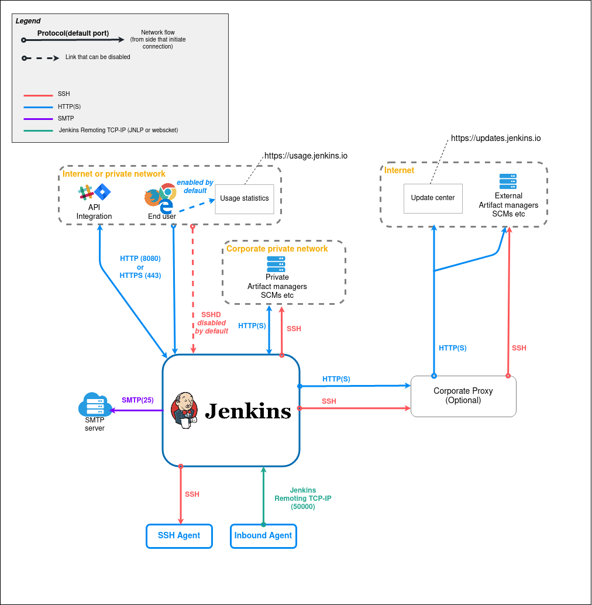
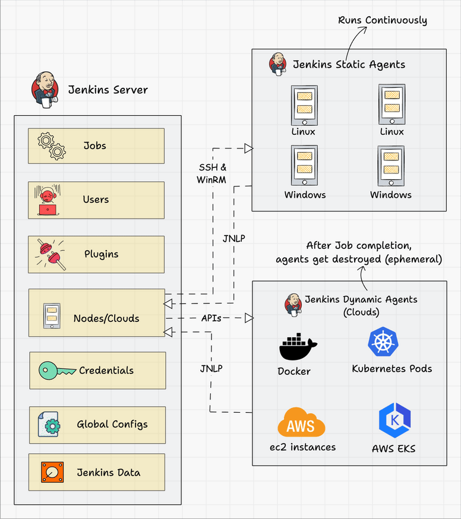

# Jenkins Script

## Jenkins Doc
- [https://www.jenkins.io/doc/](https://www.jenkins.io/doc/)
- [https://www.jenkins.io/doc/developer/](https://www.jenkins.io/doc/developer/)
- [https://devopscube.com/jenkins-architecture-explained/](https://devopscube.com/jenkins-architecture-explained/)

## Jenkins Workflow



### **Jenkins Code Samples**
- Jenkins Get Env & Params
```groovy title="This is an example get env & params"
println this.currentBuild.getDisplayName()
println this.env.JOB_NAME
println this.params["payload"]
println this.env.getProperty("BUILD_URL")
println this.env.getProperty("payload")
```
- Jenkins Get Computer
```groovy title="This is an example get computer"
import jenkins.model.Jenkins

println(Jenkins.getInstance().getComputer("agent-node-1").getDescription())
println(Jenkins.getInstance().getComputer("agent-node-1").getNode().getLabelString())

for(computer in Jenkins.getInstance().getComputers()) {
    println(computer.getName())
    println(computer.getDisplayName())
    println(computer.getNode())
    println(computer.getDescription())
    println("--------------------------------")
}
```
- Jenkins Get Node
```groovy title="This is an example get node"
import org.jenkinsci.plugins.workflow.job.WorkflowRun
import org.jenkinsci.plugins.workflow.flow.FlowExecution
import org.jenkinsci.plugins.workflow.graph.FlowGraphWalker
import org.jenkinsci.plugins.workflow.graph.FlowNode
import org.jenkinsci.plugins.workflow.cps.nodes.StepStartNode
import org.jenkinsci.plugins.workflow.actions.WorkspaceAction

hudson.model.Job job = Jenkins.getInstance().getItemByFullName("test_job")
org.jenkinsci.plugins.workflow.job.WorkflowRun build = job.getBuildByNumber(55)

if (build instanceof WorkflowRun) {
  org.jenkinsci.plugins.workflow.flow.FlowExecution execution = build.getExecution()
  // println(execution.getUrl())
  FlowGraphWalker walker = new FlowGraphWalker(execution)
  for (FlowNode flowNode : walker) {
    if (flowNode instanceof StepStartNode) {
      org.jenkinsci.plugins.workflow.support.actions.WorkspaceActionImpl action = flowNode.getAction(org.jenkinsci.plugins.workflow.actions.WorkspaceAction)
      if (action) {
        //env.NODE_NAME agent-node-1
        if (action.getNode().equalsIgnoreCase("agent-node-1")) {
          println("Workspace: ${action.getPath()}")
          println("Node ID: ${flowNode.getId()}")
    	  println("Node URL: ${flowNode.getUrl()}")
          println("-----------------------------------")
        }
      }
    }
  }
}

jenkins.model.Jenkins.instance.getNode("checker")
```
- Jenkins Get Credentials
```groovy title="This is an example get credentials"
import jenkins.model.Jenkins
import com.cloudbees.plugins.credentials.CredentialsProvider
import com.cloudbees.plugins.credentials.common.UsernamePasswordCredentials

for (def credential in CredentialsProvider.lookupCredentials(UsernamePasswordCredentials.class, Jenkins.getInstanceOrNull(), null, null)) {
  println("ID: ${credential.getId()}")
  println("User: ${credential.getUsername()}")
  println("Password: ${credential.getPassword()}")
  println("---------------------------------------------------")
}
```
- Jenkins Get Mail
```groovy title="This is an example get mail"
import com.cloudbees.plugins.credentials.CredentialsProvider
import com.cloudbees.plugins.credentials.common.UsernamePasswordCredentials
import hudson.security.SecurityRealm
import jenkins.model.Jenkins

SecurityRealm securityRealm = Jenkins.get().getSecurityRealm()
def userDetails = securityRealm.loadUserByUsername2("test_user")
println(userDetails.getAttributes(userDetails, null).get("mail").get())

UsernamePasswordCredentials credential = CredentialsProvider.lookupCredentialsInItemGroup(UsernamePasswordCredentials.class, Jenkins.get(), null, null).find { it.getId().equals("GIT-BUILDER") }
println(credential.getPassword().getPlainText())
```
- Jenkins Get Config
```groovy title="This is an example get config"
import hudson.model.Job
import org.jenkinsci.plugins.workflow.job.WorkflowJob

Job job = jenkins.model.Jenkins.instance.getItemByFullName("test_job", WorkflowJob.class) ?: jenkins.model.Jenkins.instance.getItemByFullName("test_job")
println(job.getName())

hudson.model.Job job = Jenkins.getInstance().getItemByFullName("test_job")
println("${job.getConfigFile().asString()}")
```
- Jenkins Generate Token
```groovy title="This is an example generate token"
import hudson.model.User
import hudson.security.LDAPSecurityRealm
import jenkins.security.ApiTokenProperty

def username = 'test_service_account'

def ldapRealm = Jenkins.get().getSecurityRealm()

if (ldapRealm instanceof LDAPSecurityRealm) {
    User user = User.get(username)

    if (user != null) {
        def apiTokenProperty = user.getProperty(ApiTokenProperty.class)

        if (apiTokenProperty == null) {
            apiTokenProperty = new ApiTokenProperty()
            user.addProperty(apiTokenProperty)
        }

        def newToken = apiTokenProperty.generateNewToken("test_service_account-api-token")
        user.save()

        println("Generated API Token for user ${username}: ${newToken.plainValue}")
    } else {
        println("User ${username} not found.")
    }
} else {
    println("LDAPSecurityRealm is not configured.")
}
```
```groovy title="This is an example generate token"
import hudson.model.User
import jenkins.security.ApiTokenProperty
import jenkins.security.apitoken.ApiTokenStore
import jenkins.security.apitoken.TokenUuidAndPlainValue

def env = System.getenv()
def username = "test_service_account"
User user = User.get(username)

ApiTokenProperty tokenProperty = user.getProperty(ApiTokenProperty.class)

if (!tokenProperty){
  tokenProperty = new ApiTokenProperty()
  user.addProperty(tokenProperty)
}

TokenUuidAndPlainValue token = tokenProperty.tokenStore.generateNewToken(username + "-token")

user.save()

println(token.plainValue)
```
- Jenkins Get Node IP and Labels
```groovy title="This is an example get node IP and labels mapping"
import jenkins.model.Jenkins

void getNodeIPLabelsMapping() {
    Jenkins.get().computers.each { computer ->
        if (computer.online && computer.node) {
            println("host=${computer.getHostName()}, labels=${computer.node.getLabelString()}")
        }
    }
}

getNodeIPLabelsMapping()
```
```groovy title="This is an example get node IP and labels mapping"
import jenkins.model.Jenkins
import hudson.plugins.sshslaves.SSHLauncher

void getNodeIPLabelsMapping() {
    Jenkins.get().nodes.each { node ->
        Computer computer = node.toComputer()
        if (computer?.online) {
            def launcher = computer.getLauncher()
            if (launcher instanceof SSHLauncher) {
                println("host=${launcher.host}, labels=${node.getLabelString()}")
            }
        }
    }
}

getNodeIPLabelsMapping()
```
```groovy title="This is an example get node IP and labels mapping"
import jenkins.model.Jenkins

void getNodeIPLabelsMapping() {
    Jenkins.get().computers.each { computer ->
        if (computer.online) {
            XmlFile xmlFile = Jenkins.get().getNodesObject().getConfigFile(computer.node.nodeName)
            if (xmlFile.exists()) {
                Document doc = XmlUtil.parseXml(xmlFile.file.text)
                String host = doc.getElementsByTagName("host")?.item(0)?.textContent
                String labelString = doc.getElementsByTagName("label")?.item(0)?.textContent
                if (host && labelString) {
                    println("host=${host}, labels=${labelString}")
                }
            }
        }
    }
}

getNodeIPLabelsMapping()
```
!!! quote
    For more details, please refer to the official Jenkins documentation [Jenkins Official Website](https://www.jenkins.io/)
